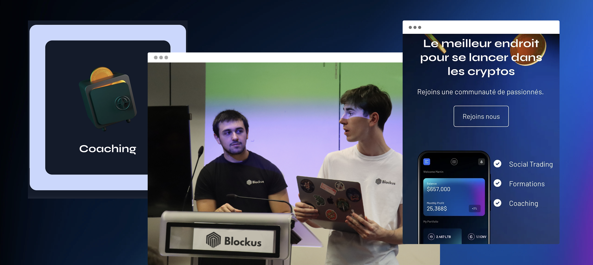

# 🏄‍♂️ Audran Lemaitre

**`French Digital Craftsman (Love web3 & Finance)`**

Co-founder of Blockus and content creator building my version of the digital world one step at a time. I am exploring new way of building financial and banking applications to solve real-life problems with code. I share this passion through my public videos and formations with Blockus. I also write technical articles on the HelloToken media. 

   

       
       
      
      
   

---

### 🧰 Languages and Tools

          
#

### 📺 Latest YouTube Videos

<!-- BEGIN YOUTUBE-CARDS -->

<!-- END YOUTUBE-CARDS -->

#

### 📊 Blockus

#

 
<h3>👨‍💻 More about me </h3>

Currently pursuing a master's degree in market finance at the IESEG School of Management in Lille, I co-created Blockus: a structure that aims to democratize investment in blockchain technologies to the greatest number of people. 

I am passionate about the different uses that these same technologies can have in the banking and financial sector: tokenization of real assets, digital identity, transparency, automation via smart contract, elimination of costly intermediaries, etc. I want to dedicate my career to improving the current financial system. 

Moreover, I am always looking for new ways to enrich my knowledge, meet new people and create impactful projects. I am notably invested in the web3 ecosystem as a writer at HelloToken. I'm also learning to code dApps to deepen my technical knowledge.

Feel free to contact me if you are interested in these topics!

---
[website]: https://blockuslearn.editorx.io/blockus/
[youtube]: https://www.youtube.com/@Blockus
[LinkedIn]: https://www.linkedin.com/in/audranlemaitre/
[HelloToken]: https://hellotoken.io/